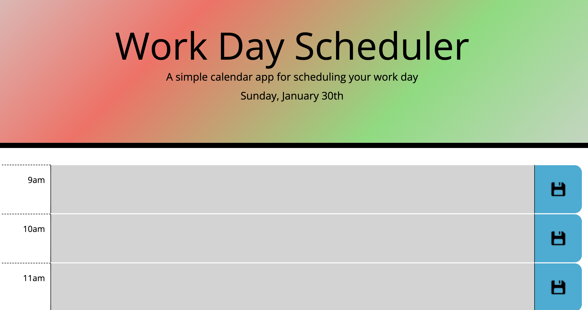
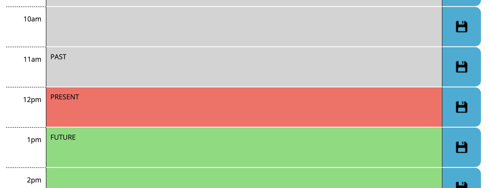

# Day Planner

## Mitchel Wachtel - mitchel.wachtel@gmail.com

---
## Description

Technologies used: Javascript with HTML, CSS, jQuery, Bootstrap, and Moment.js. GitHub pages was used in order to publish the site.

This webpage is dynamic to help a user organize their day. First, the date is displayed in the header. Second, the hours are color coded based on whether the times have passed, are current, or are in the future. When you type in the textarea, the information is saved when the user clicks the corresponding save button. This information will continue to re-populate when the page is loaded throughout the day. 

I was motivated by my excitement to practice all these different technologies: Moment.js and Bootstrap are brand new to me this week, and everything else is still new. I'm excited to get more comfortable with these APIs and this project has certainly helped to build my confidence.

I believe my biggest takeaway is how helpful military time is to working with these values. Once I realized I could convert 1pm-5pm to 13-17, I almost felt like I was cheating because the logic simply flowed from there. I also see the benefit of adding a data attribute to the button elements. Being able to grab the data from the button that was clicked allowed me to target the correct textareas.

There were several difficult moments in which I had to stop and really process how to accomplish the goal. First was formatting the page with rows and columns. I build the entire page with a bootstrap table, but then went back and build it with a bootstrap grid. In the JS logic, I got caught up with the conditional statements to color the hours. I eventually thought of military time to allow me to compare the times more efficiently. I had to find a way to get the buttons to only save the text in the corresponding textarea. I solved this issue by adding a data attribute to the button (and image) so that, when clicked, they would be able to tell the program which textarea to save.

Next Steps: I would add the ability for users to look into the future and schedule upcoming dates.

---

### **Deployed Site** can be found *[here](https://www.mitchelwachtel.me/day-planner/)*. 

---

### **GitHub Repository** can be found *[here](https://github.com/mitchelwachtel/day-planner)*.

---
## Installation 

Simply open in a brower and the webpage should appear as below.

---
## Credits

A helpful resource when trying to access data from button click: *[here](https://stackoverflow.com/questions/7723188/what-properties-can-i-use-with-event-target)*. Also helpful in working with the bootstrap textareas: *[here](https://mdbootstrap.com/docs/b4/jquery/forms/textarea/)*.

---
## Licensed

GNU General Public License v3.0